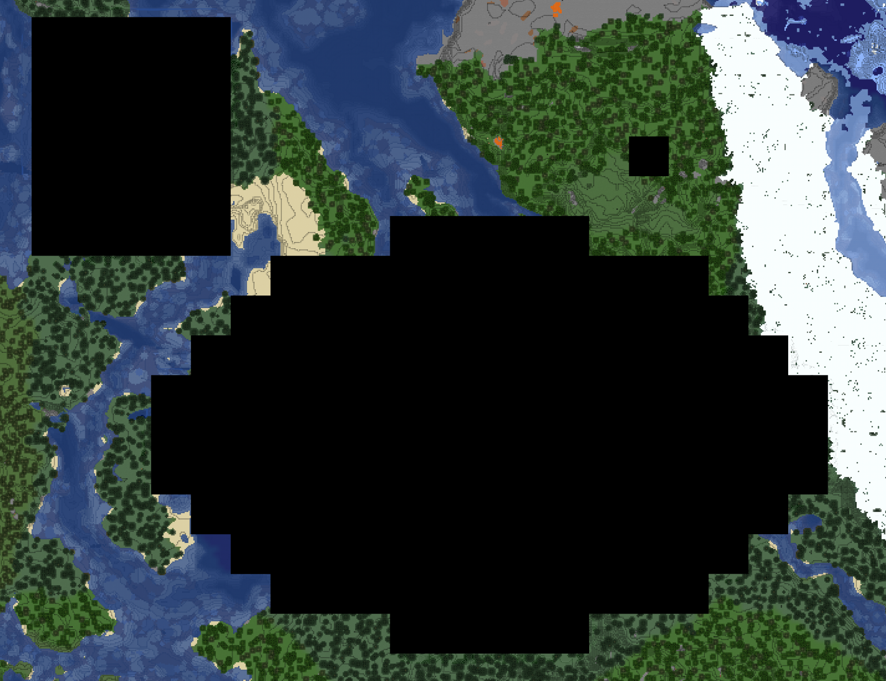
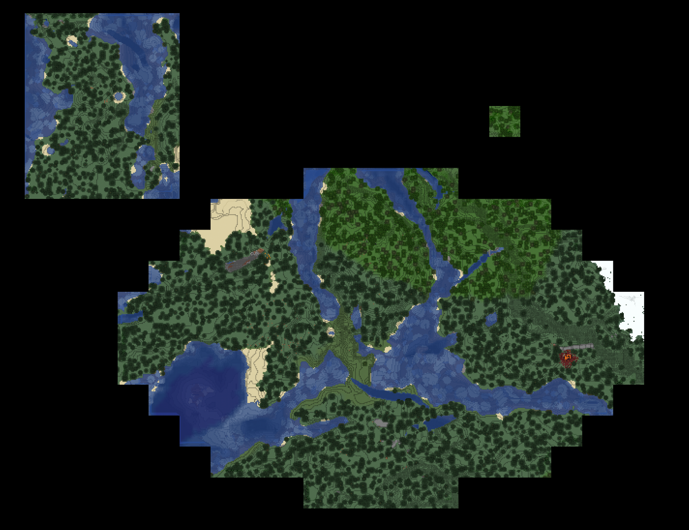
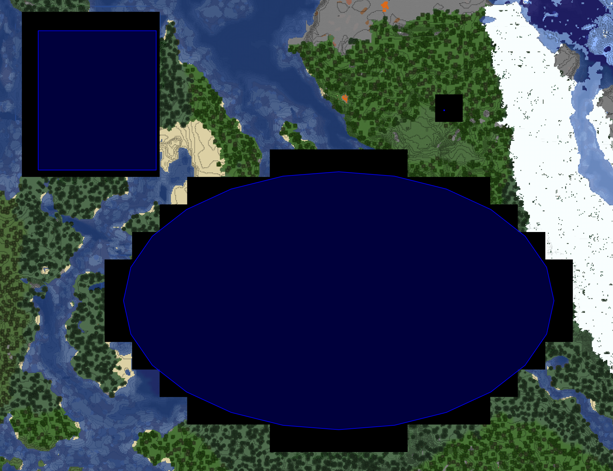

# BlueMap Area Control

[](https://github.com/TechnicJelle/BlueMapAreaControl/releases/latest)
[](https://bstats.org/plugin/bukkit/BlueMap%20Area%20Control/18345)

A Minecraft Paper BlueMap addon for greater control over which areas get rendered



Compatible with Paper 1.13+, just like BlueMap itself.

To reload this plugin, just reload BlueMap itself with `/bluemap reload`.\
You will probably need to rerender your map(s) if you change this plugin's configs.\
You can do that with the command `/bluemap purge <map-id>`


## [Click here to download!](../../releases/latest)

## Configuration
The configuration for this plugin uses [HOCON](https://github.com/lightbend/config/blob/main/HOCON.md) files.

In the `plugins/BlueMapAreaControl` folder you should make a `.conf` file for each BlueMap map you want to control, with the map-id as the name.\
When you install this plugin for the first time, it will generate a template config for each registered BlueMap map.

This is the default config:
```
is-whitelist=false
debug-mode=false

areas=[
	# Define areas here
]
```

`is-whitelist` is a boolean that defines whether the areas list is a whitelist or a blacklist.\
When it's a blacklist, all areas will be rendered _except_ the ones in the list.\
When it's a whitelist, only the areas in the list will be rendered:


`debug-mode` is a boolean that defines whether the debug mode is enabled.\
When it's enabled, all configured areas will be marked on the map with a blue border.\
This makes it easier to visualise the areas you're defining, before you (re)render the map.


All areas should be denoted within the `areas` square brackets `[ ]`

The numbers in the configs are in blocks, but please be aware that BlueMap will round them down to the nearest tile.

There are currently two types of area available that you can use:

- Rectangle:
```hocon
{
	type = rect
	# X coordinate of one corner of the rectangle in blocks
	x1 = -30
	# Z coordinate of one corner of the rectangle in blocks
	z1 = -30
	# X coordinate of the opposite corner of the rectangle in blocks
	x2 = 33
	# Z coordinate of the opposite corner of the rectangle in blocks
	z2 = 33
}
```

- Ellipse:
```hocon
{
	type = ellipse
	# Center X coordinate in blocks
	x = 18
	# Center Z coordinate in blocks
	z = 114
	# Radius X in blocks
	rx = 176
	# Radius Z in blocks
	rz = 112
}
```

**A full example config can be found [here](https://github.com/TechnicJelle/BlueMapAreaControl/blob/main/example.conf)**

## Support
To get support with this plugin, join the [BlueMap Discord server](https://bluecolo.red/map-discord)
and ask your questions in [#3rd-party-support](https://discord.com/channels/665868367416131594/863844716047106068). You're welcome to ping me, @TechnicJelle.

## [TODO list](https://github.com/users/TechnicJelle/projects/1)
